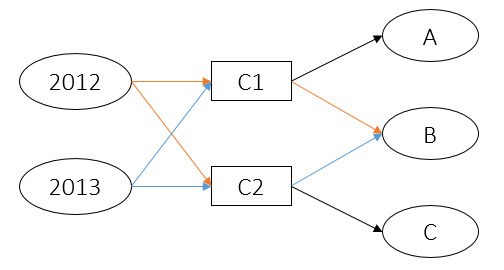
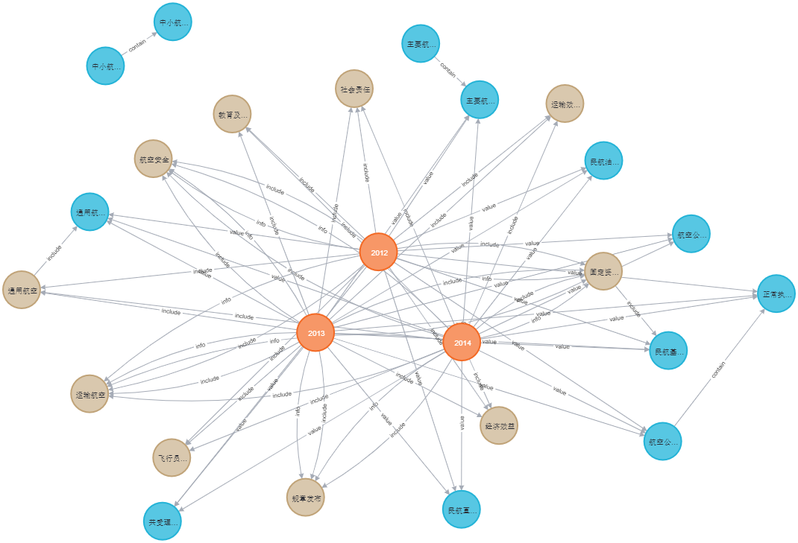
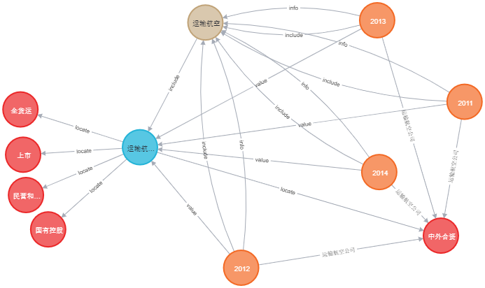
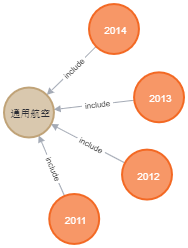
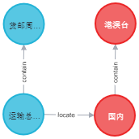
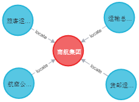
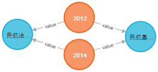
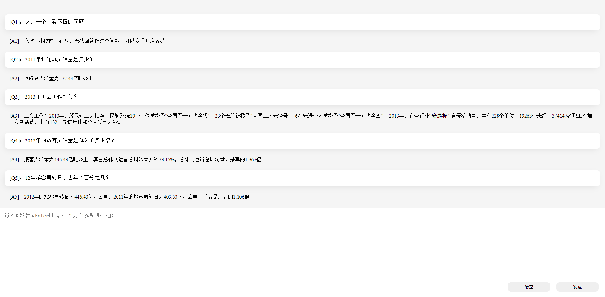
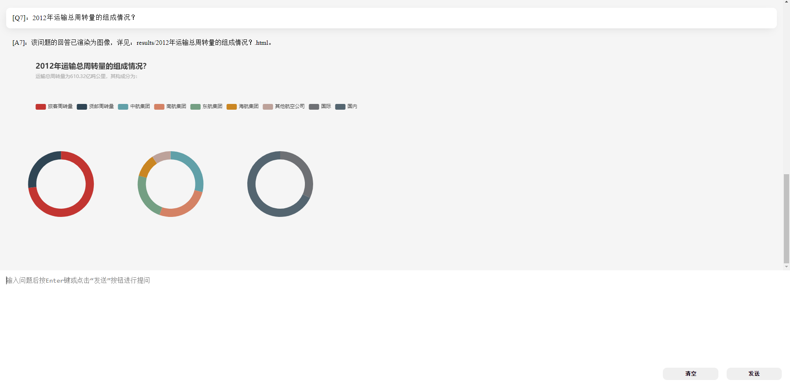
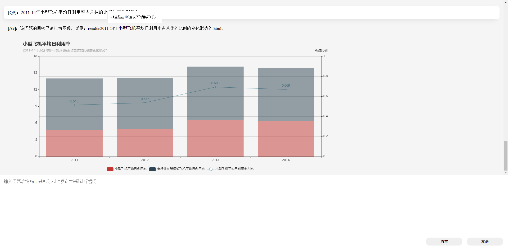

# CivilAviation Q&A
A QA system based on Civil Aviation knowledge graph. 构建民航业知识图谱并实现语义查询。

## 平台
- Windows 10 x64
- Python 3.7
- Neo4j community 3.5.20

## 运行
1. 确保安装所需依赖
   ```
     pip install -r requirements.txt
   ```
   注：`python-Levenshtein` 如果安装不成功，则可以下载对其进行离线安装。

2. 构建知识图谱

   修改`const.py`文件中连接数据库使用的`URI`，`USERNAME`和`PASSWORD`的值。然后执行：
   ```
     python build_cakg.py
   ```
   运行大约需要2~5分钟。

3. 可以使用两种方式运行：
   1. 运行命令行端
      ```
        python run_cmd.py
       ```
      普通问题的回答以字符串的形式给出；带有图表的回答，图表会被渲染至`results`文件夹中。
   2. 运行web端（效果图见下文）
      ```
        python run_web.py
      ```
      带有图表的回答和普通回答一样会被渲染至web页面中，同时也被保存至本地`results`文件夹中。
      
      注1：最好使用谷歌浏览器（Google Chrome）；
      
      注2：生成图表的文件夹地址可以在`const.py`中更改`CHART_RENDER_DIR`。
4. have fun!

## 简介
### 一. 项目结构
```
---------------------------------------  root
   |------data/                        # 数据存放
          |------dicts/                # 存放特征词（运行build_cakg.py后自动生成）
          |------question/             # 存放问句中的疑问词
          |------reference/            # 存放指代词
          |------tail/                 # 存放尾词（后缀词）
          |------data.json             # 从年报中组织出的数据
          |------raw.7z                # 11-19年的年报
   |------demo/                        # 以jupyter-notebook的形式给出了各种问题类型的演示和说明
   |------doc/                         # 存放有关readme的文件
   |------lib/                         # 函数库
   |------results/                     # 存放某些问题生成的图表（会自动生成）
   |------test/                        # 存放一些单元测试
   |------web/                         # web app
   ......
   |------answer_search.py             # 回答组织器
   |------build_cakg.py                # 构建知识图谱
   |------chatbot.py                   # 自动问答器
   |------const.py                     # 常量
   |------question_classifier.py       # 分类器
   |------question_parser.py           # 解析器
   ......
```

### 二. 数据组织
#### 1. 基本构想
通过浏览公报发现：
1. 每一年所涉及的目录大差不差，有时多有时少，或者只是改个名字；
2. 目录中涉及的指标每年都有一定的变动，而且某些指标里面嵌套指标，还有些指标中给出了各地区的组成值；
3. 指标的值有数值类型，也有字符串类型，有的有单位，有些则没有，而且有些单位在某些年份还不同。

基于上述几点，我将知识图谱的构建以年份为中心展开，将各个目录、指标等等实体作为知识图谱的结点。结点与结点之间相连接的关系称为`结构关系`（详细见下文），那么将每个年份结点到各个指标和地区的关系称为`值关系`（详细见下文）。将结构和值两种关系拆开，

1. 从结构关系来看，不用一个年度录入一个年度的所有指标，每个年度中肯定有重复指标，这样避免了数据冗余。若每年的指标位置基本不变，则上述做法直接可行，但实际上指标出现的位置可能每年都飘忽不定，所以若直接按上述做法会出现这种情况：
   
   `假设2012年指标C1包含指标A、B，指标C2包含指标C；2013年指标C1包含指标A，指标C2包含指标B、C；则其结构关系为:`
   
   
 
   其中橙色的边是2012年特有的，蓝色的则是2013年特有的，而黑色的是它们共有的。但在知识图谱中这些边没有颜色之分，是按上图整个结构存储的，这就造成了一个父子结构关系错乱的问题，比如：我要查找13年指标C1包含的所有指标，则A和B都会被返回，而实际上B不应该被返回。
   
   为了解决上述问题，并且不增加任何额外的关系，我为每个关系引入了一个生命周期属性`life`。这个属性运用了掩码的思想，每个年份维护自己的掩码（运行构建知识图谱脚本时会被自动生成），在遇到上述问题时，拿来和关系中的life做`与`运算，若结果不为0，就说明此年份包含此指标，反之则不含。
2. 从值关系来看，问题中也是直接给出年份和指标名称，这样也方便查询。

部分结点间的关系如下图：(橙色为年份，棕色为目录，蓝色为指标)



部分结点间的关系如下图：**(橙色为年份，棕色为目录，蓝色为指标，红色为地区/机场/公司集团，下同)**



#### 2. 知识图谱实体类型
| 实体类型 | 含义 | 数量 | 举例 |
|--|--|--|--|
| Year | 年份 | 9 | 2011，2012 |
| Catalog | 目录 | 16 | 运输航空，航空安全 |
| Index | 指标 | 242 | 运输总周转量，货邮运输量 |
| Area | 地区/机场/公司集团 | 35 | 港澳台，中航集团 |

#### 3. 知识图谱实体关系类型
| 实体结构关系类型 | 含义 | 数量 | 举例 |
|--|--|--|--|
| include | 年度包括目录、目录包括指标 | 193 | |
| contain  | 指标（父）含有指标（子）、地区（父）含有地区（子） | 148 | |
| locate | 指标位于某地区 | 93 | |

| 实体值关系类型 | 含义 | 数量 | 举例 |
|--|--|--|--|
| info | 某年度的目录信息 | 45 | |
| value | 某年度的指标值 | 1194 |  |
| 具体的指标名称 | 某年度某地区的指标值 | 781 | |

#### 4. 知识图谱属性类型
| 属性类型 | 含义 | 举例 |
|--|--|--|
| info | 年份或目录的整体概况 | 全年航空安全形势稳定，旅客运输和... |
| name | 各实体名称 | 2014，国内，货邮周转量 |
| value | 指标或地区的值 | 451.2，0，22 |
| unit | 指标或地区值的单位 | 亿吨公里，%，万元 |
| repr | 地区值所代表的含义 | 航线（不含港澳台），吞吐量占比 |
| child_id | 同一（父）指标下不同（子）指标拥有相同child_id的可视为构成父指标的一个角度 | 0，1，2 ... |
| life | （结构关系）生命周期 | 0x179, 0x008 |

### 三. 问题预处理
主要指年份和指标两个角度的预处理，此部分详见`lib/complement.py`。
1. 年份角度
    对问题中的年份进行替换，方便特征词识别，例：
    ```
       11年 -> 2011年
       两千一十一年 -> 2011年
       11-15年 -> 2011年,2012年,2013年,2014年,2015年
       13到15年 -> 2013年,2014年,2015年

       13年比前年 -> 2013年比2011年
       15年比大大前年 -> 2015年比2011年

       16年比3年前 -> 2016年比2013年
       16年与前三年相比 -> 2016年与2015年,2014年,2013年相比
       ......
   ```
2. 指标角度
    对问题中的指标名进行替换，避免因错字漏字而特征词识别不成功。通过`Levenshetin`算法实现对指标名的模糊查询。例：
     ```
        游客周转量 -> 旅客周转量
        ......
    ```

### 四. 问题分类
问题的分类是基于特征词的分类，使用`ahocorasick`算法。

下表给出的是各种问题的类型，更详细的内容请参见项目`demo`中的`demo1~4.ipynb`。

| 问题类型 | 含义 | 举例 |
|--|--|--|
| year_status | 年度整体状况 | 2011年整体状况如何？ |
| catalog_status | 年度目录状况 | 2012年教育及科技状况如何？ |
| catalog_change | 年度间目录变化 | 12年比11年少了哪些目录？ |
| index_change | 年度间指标变化 | 13年比前年增加了哪些指标 ？|
| exist_catalog | 年度有哪些目录 | 11年有哪些目录？ |
| begin_stats | 指标何时开始统计 | 在哪年最先出现了航空公司营业收入数据？ |
| index_value | 指标值 | 13年货邮周转量为？ |
| index_overall | 指标占总比 | 13年旅客周转量占其总体的百分之几？ |
| index_2_overall | 指标占总比的变化 | 13年运输总周转量占其父级指标的倍数比11年降低了多少？ |
| indexes_m_compare | 指标的倍数比较 | 11年旅客周转量是新增机场数量的几倍？ |
| indexes_n_compare | 指标的和差比较 | 12年旅客周转量比货邮周转量少多少？ |
| indexes_g_compare | 指标的同比比较 | 11年旅客周转量同比增长 |
| indexes_2m_compare | 年度之间指标的倍数比较 | 12年新增机场数量是11年的几倍？ |
| indexes_2n_compare | 年度之间指标的和差比较 | 12年比13年货邮运输量增加了多少？ |
| area_value | 地区指标值 | 11年国内运输总周转量是？ |
| area_overall | 地区指标占总比 | 11年港澳台运输总周转量占其父级地区指标的百分之几？ |
| area_2_overall | 地区指标占总比的变化 | 12年港澳台的旅客运输量占总体的百分比比去年变化了多少？ |
| areas_m_compare | 地区指标的倍数比较 | 13年国内货邮周转量是国际的几倍？ |
| areas_n_compare | 地区指标的和差比较 | 11年港澳台旅客运输量比国内的少多少？ |
| areas_g_compare | 地区指标的同比比较 | 12年国内旅客运输量同比变化？ |
| areas_2m_compare | 年度之间地区指标的倍数比较 | 13年国内货邮周转量占11年的百分之几？ |
| areas_2n_compare | 年度之间地区指标的和差比较 | 13年国内运输总周转量比12年多多少？ |
| index_compose | 指标的组成 | 13年运输总周转量的子集有？ |
| indexes_trend | 指标的变化 | 11-14年节能减排的情况？ |
| areas_trend | 地区指标的变化 | 11-13年港澳台运输总周转量分布状况？ |
| indexes_overall_trend | 指标占总比的变化 | 11-13年货邮运输量占总体指标的比例的变化？ |
| areas_overall_trend | 地区指标占总比的变化 | 11-13年港澳台运输总周转量占其总体地区的比值变化情况？ |
| indexes_change | 指标个数的变化 | 11-13年指标变化情况？ |
| catalogs_change | 目录个数的变化 | 11-13年目录变化情况？ |
| indexes_max | 指标的最值 | 11-13年货邮周转量的最大值？ |

### 五. Web APP 
web端使用Flask构建，采用前后端分离的方式。问答界面较为简洁。但可实现以下功能：
1. 回答带有的图表可以直接渲染至页面；
2. 回答中某些关键词以`tooltips`的形式进行了解释说明（关键词取自年报的注释部分）。







## 说明
1. **项目因经过多次重构，故难免有些晦涩之处，欢迎提问**；
2. **数据组织或问题分类难免有不足之处，若有更好的想法，欢迎提出**；
3. **单元测试对各种问题只能尽可能多的照顾到，若有什么问题，欢迎指正**；
4. 若有疑问，留言、私信、open issue都可，我将尽可能及时回复；
5. 若有BUG，请将 “所问问题” ，“报错” 或其他有用信息通过上述方式提供。

## 参考
1. 项目结构参考：https://github.com/liuhuanyong/QASystemOnMedicalKG
2. web app 中 tooltips 的实现参考：http://www.webkaka.com/tutorial/html/2020/080295/
3. 数据均取自中国民用航空局发布的2011~2019年《年度民航行业发展统计公布》